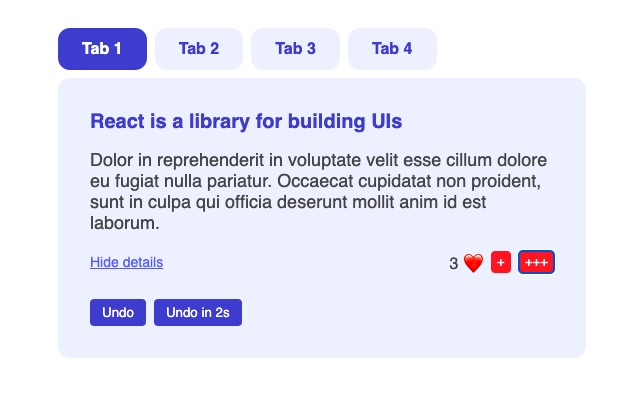

# How React Works

## Table of contents

- [Overview](#overview)
  - [The challenge](#the-challenge)
  - [Screenshot](#screenshot)
  - [Links](#links)
- [My process](#my-process)
  - [Built with](#built-with)
  - [What I learned](#what-i-learned)
  - [Continued development](#continued-development)
- [Author](#author)

## Overview

### The challenge

Users should be able to:

- View the optimal layout for the app depending on their device's screen size
- Select tabs and see react learning tips.
- Hide or show lorem under tip.
- Add hearts by 1 or 3.
- Can undo hearts right away or in 2 seconds.

### Screenshot

### Links

- Live Site URL: [View](https://howreactworks1024.netlify.app/)

## My process

- This React lesson introduces a tabbed interface where users can switch between different pieces of content.
- The `Tabbed` component renders several `Tab` buttons and handles switching between them using the `useState` hook to track the currently active tab.
- The `TabContent` component displays detailed content based on the selected tab and allows users to toggle the visibility of the details.
- It also includes interactive features like incrementing a "likes" counter, with a demonstration of how to use state callbacks to handle multiple state updates efficiently (as seen in the `handleTripleInc` function).
- Additionally, the component showcases how to reset state using functions like `handleUndo` and `handleUndoLater` with a timeout.
- The last tab displays a different piece of content that resets the state when selected.

### Built with

- Semantic HTML5 markup
- CSS custom properties
- Mobile-Responsive Design
- JavaScript - Scripting language
- [React](https://reactjs.org/) - JS library

### What I learned

This was a class lesson to learn about the basics for React.

### Continued development

maybe use later

## Author

- Website - [Cameron Howze](https://camkol.github.io/)
- Frontend Mentor - [@camkol](https://www.frontendmentor.io/profile/camkol)
- GitHub- [@camkol](https://github.com/camkol)
- LinkedIn - [@cameron-howze](https://www.linkedin.com/in/cameron-howze-28a646109/)
- E-Mail - [cameronhowze4@outlook.com](mailto:cameronhowze4@outlook.com)
